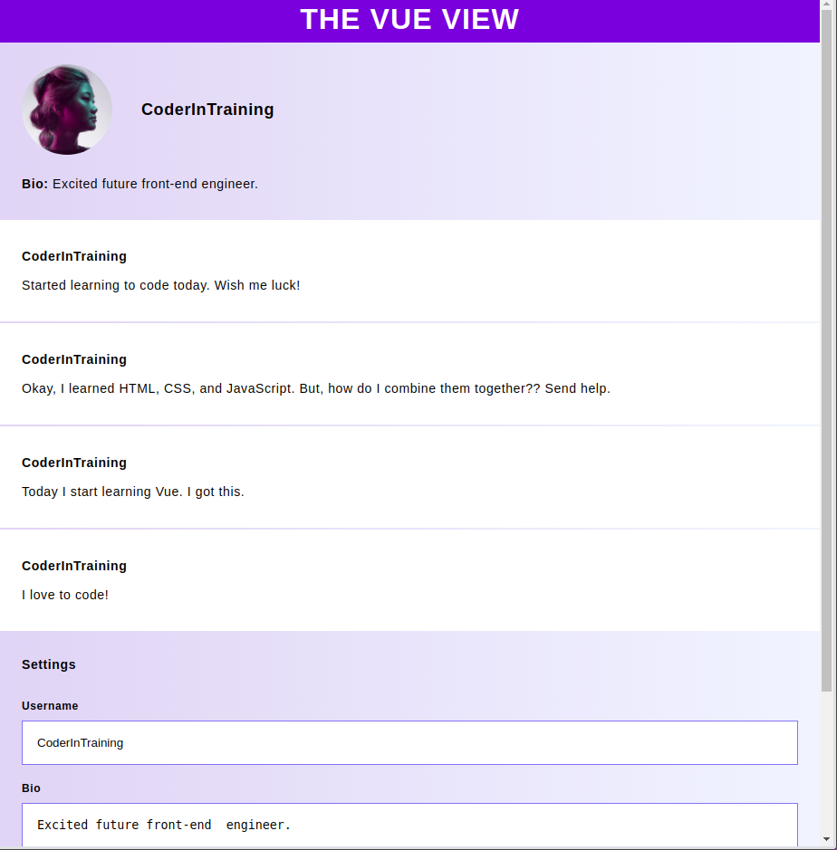
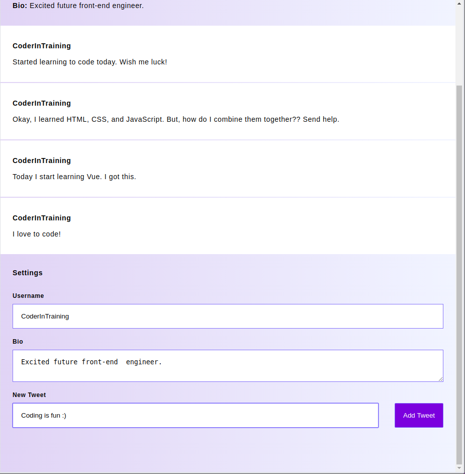

# Vue: Learning the Basics

This is an implementation of the Codecademy lesson 'Intro to Vue'. This Vue app is a twitter-esque webapp.

Things learned:
- Mustache templates
- Directives
- Components
- Vue's Virtual DOM

## Screenshots

